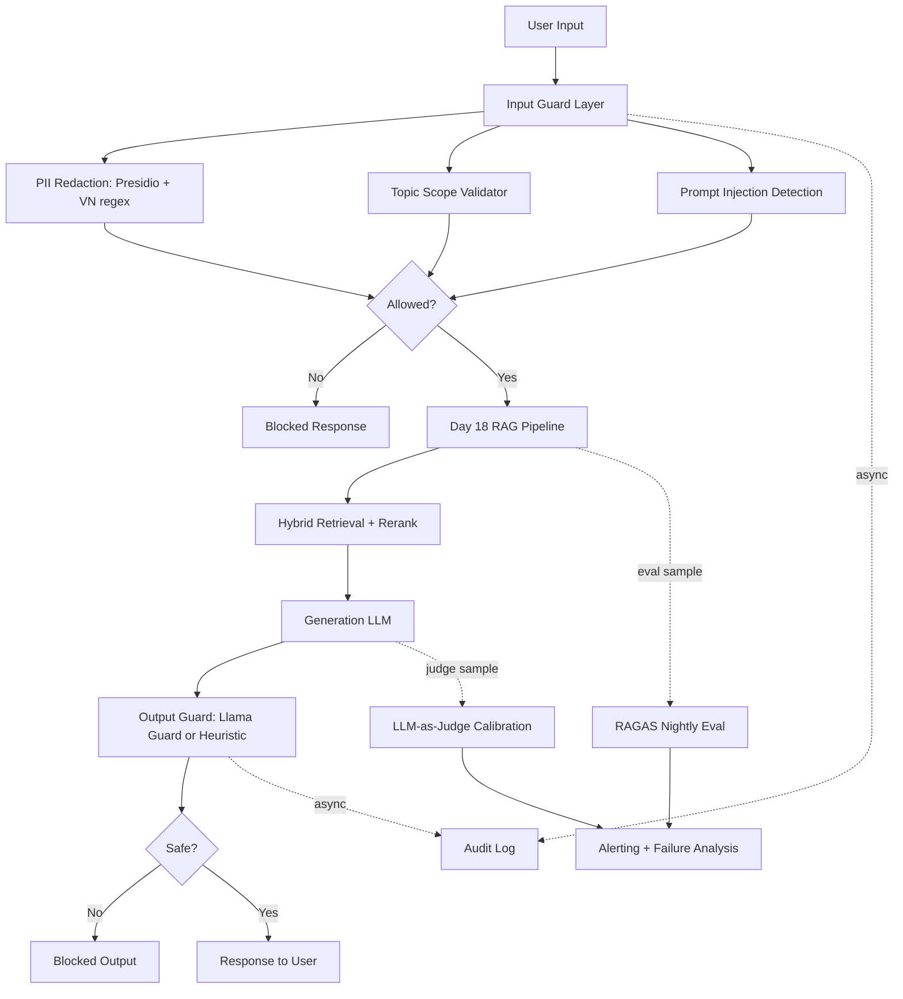

# Phase D - Production Blueprint

## 1. SLO Definition

| Metric | Current | Alert Threshold | Severity | Status |
|--------|---------|-----------------|----------|--------|
| Faithfulness | 0.7287 | 0.7500 | P1 | alert |
| Answer Relevancy | 0.4510 | 0.7000 | P1 | alert |
| Context Precision | 0.7450 | 0.6000 | P2 | pass |
| Context Recall | 0.7500 | 0.6500 | P1 | pass |
| Judge Cohen Kappa | 0.2754 | 0.6000 | P2 | alert |
| PII Recall | 1.0000 | 0.8000 | P1 | pass |
| Adversarial Detection | 0.9290 | 0.7000 | P1 | pass |
| Output Unsafe Detection | 1.0000 | 0.8000 | P1 | pass |
| Output False Positive Rate | 0.0000 | 0.0500 | P2 | pass |
| Total P95 Latency ms | 1063.0120 | 5000.0000 | P2 | pass |
| Guardrail P95 Latency ms | 1045.0710 | 1200.0000 | P2 | pass |

## 2. Architecture Diagram

## 3. Alert Playbook

### Incident: Faithfulness drops below 0.75

- Severity: P1
- Detection: nightly RAGAS eval or pull-request eval gate
- Likely causes: weak context, prompt drift, stale index, model behavior change
- Investigation steps: inspect bottom questions, compare retrieved contexts, check recent prompt/index changes, verify API/model version
- Resolution: rollback prompt/model, rebuild index, increase retrieval candidates, add answer verifier
- SLO impact: answer trust degradation

### Incident: Context Recall drops below 0.65

- Severity: P1
- Detection: RAGAS context_recall aggregate or cluster analysis
- Likely causes: chunking regression, missing corpus ingestion, dense embedding mismatch, Qdrant collection drift
- Investigation steps: check corpus count, inspect retriever top-k, validate embedding model, compare BM25 vs dense hits
- Resolution: re-index corpus, restore embedding model, raise retrieval top-k, add query expansion
- SLO impact: system cannot find supporting evidence

### Incident: PII recall below 0.80

- Severity: P1
- Detection: Phase C PII guard regression suite
- Likely causes: disabled Presidio model, regex regression, new local identifier format
- Investigation steps: review failed examples, check dependency installation, compare regex patterns
- Resolution: add recognizer pattern, restore Presidio install, expand multilingual test set
- SLO impact: privacy leakage risk

### Incident: Output guard latency P95 above 1200ms

- Severity: P2
- Detection: latency benchmark or production trace sampling
- Likely causes: external Llama Guard API latency, network instability, sequential guard calls
- Investigation steps: compare provider latency, check timeout/retry logs, validate async execution
- Resolution: run output guard in parallel where possible, lower max tokens, switch to local/cheaper guard for low-risk traffic
- SLO impact: degraded user experience

## 4. Cost Analysis

Assumption: 100,000 production queries per month plus nightly eval sampling.

| Component | Unit Cost | Volume | Monthly Cost |
|-----------|-----------|--------|--------------|
| Input PII guard | $0.00 / query | 100000 | $0.00 |
| Topic + injection guard | $0.00 / query | 100000 | $0.00 |
| RAG generation gpt-4o-mini | $0.00025 / query | 100000 | $25.00 |
| RAGAS nightly sample | $0.012 / eval | 1500 | $18.00 |
| LLM judge calibration | $0.010 / pair | 1000 | $10.00 |
| Llama Guard API | $0.0005 / output | 100000 | $50.00 |
| Langfuse/LangSmith logging | free tier / sampled | 100000 | $0.00 |
| **Total** |  |  | **$103.00** |

## 5. Cost Optimization Opportunities

- Run deterministic PII/topic/injection checks before any LLM call to block bad requests early.
- Sample RAGAS and judge calibration instead of evaluating every production query.
- Route low-risk responses through heuristic output guard and reserve Llama Guard for risky topics.
- Cache embeddings and retrieval results for repeated test/eval questions.
- Use pairwise judge only for candidate comparisons; use absolute scoring for periodic monitoring.

## 6. Production Readiness Notes

- RAGAS source: `ragas` over 50 questions.
- Judge calibration: kappa `0.275` (fair agreement).
- Guardrails benchmark: total P95 `1063.0ms`, guardrail P95 estimate `1045.1ms`.
- Current highest-risk gaps should be addressed before production: answer relevancy and judge calibration agreement.
